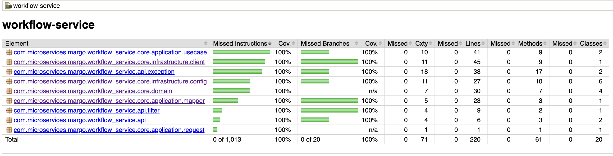
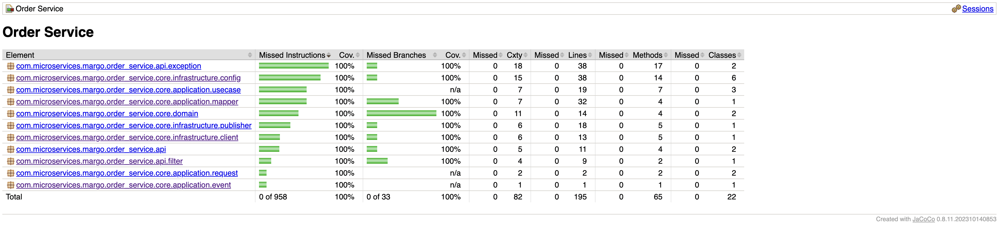
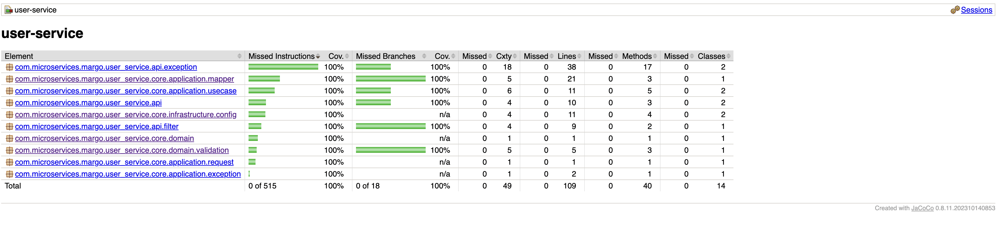
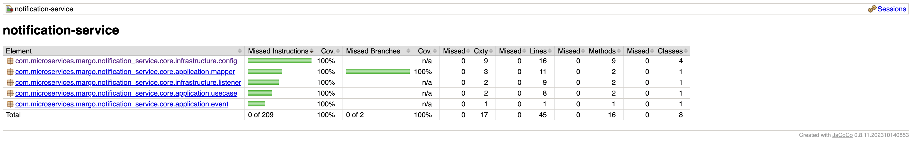
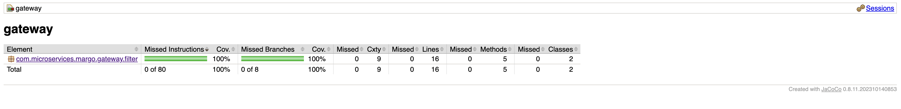

# Report 

## Unit Tests

#### My prompt to Claude to get the tests:

```text
Generate tests for order service, notification service, workflow service, gateway using exactly the same pattern as I have in the user service (Arrange, Act, Assert comments; data class helper (UserData class), dry method helpers, full coverage, only meaningful tests, parameterized where applicable, org.assertj library for assertions, display name on tests only when their name is too large, use same pattern for test naming). Achieve 100% coverage.
```
**Note**: I had to separately ask him for tests for some of the classes after exploring the coverage because it did not give me the full coverage straight away. Additionally, some tests could not even compile until I either applied fixes manually or asked him for that.

**Link to this chat**: https://claude.ai/share/bf1b0f92-2d9d-47cc-bd26-1cc2143d0957

### Coverage

I explored the test coverage with **[Jacoco](https://www.baeldung.com/jacoco)** plugin explicitly excluding the main Application class, because it's always marking the main method as uncovered.

**Lines coverage**: the amount of code that has been exercised based on the number of Java byte code instructions called by the tests.
**Branches coverage**: the percent of exercised branches in the code, typically related to if/else and switch statements.
**Cyclomatic complexity**:the complexity of code by giving the number of paths needed to cover all the possible paths in a code through linear combination.

#### Workflow Service

* 220 lines
* 61 methods
* 20 classes
* 20 branches (100%)
* 1013 instructions (100%)
* 71 cyclomatic complexity

#### Order Service

* 195 lines
* 65 methods
* 22 classes
* 33 branches (100%)
* 958 instructions (100%)
* 82 cyclomatic complexity

#### User Service

* 109 lines
* 40 methods
* 14 classes
* 18 branches (100%)
* 515 instructions (100%)
* 49 cyclomatic complexity

#### Notification Service

* 45 lines
* 16 methods
* 8 classes
* 2 branches (100%)
* 209 instructions (100%)
* 17 cyclomatic complexity

#### Gateway

* 16 lines
* 5 methods
* 2 classes
* 8 branches (100%)
* 80 instructions (100%)
* 9 cyclomatic complexity

## Contract Tests

These tests were implemented for the **order** and **user** services within `contract` _test_ package.

## Security Tests

These tests were also implemented for the **order** and **user** services within `security` _test_ package.

## Purely AI Generated Unit Tests

These tests live on the branch `ai-tests`.

I used **claude** for those purposes.

_My thoughts are not straightforward. On one side, it did generate lots of tests. On another side, some of their quality is not the highest._

### Advantages

1) Relatively fast (at least definitely faster than doing it manually)
2) Most of them work, so the only thing you need to do is to adjust those that don't work and maybe clean some things.
3) Time-saver

### Disadvantages

1) To get full coverage (or something close to full) I had to ask claude 3 times, even though I stated my need in the first prompt.
2) Some tests do not work due to various reasons:
    * unnecessary stubbings `UnnecessaryStubbingException`
    * misconfigurations: `NotificationServiceApplicationTest`, `WorkflowServiceApplicationTest` and `UserServiceApplicationTest` failed to load the application context
    * _wanted but not invoked_: AI failed to understand where the method should have been invoked
    * assertion errors (not very common): occurred within `objectMapper_serializesLocalDateTime`, `isValid_returnsFalse_whenTooYoung`, `isValid_returnsFalse_whenFutureDate` -> incorrect assertion
3) extensive love to `any()` arguments
4) no love for constants
5) common usage of deprecated annotations: `@MockBean` instead of `@Mock`
6) strange comments instead of `//Arrange //Act //Assert` or `//Given //When //Then` (even though I did not ask to put those, but still)

**Conclusion**: although, my list of disadvantages is bigger than that of advantages, I can confidently state that you should use AI for test generation because it's definitely a time-saver.
However, you have to define a clear test generation strategy (prompt) and always carefully review and adjust the outcome, so that your tests are clear, dry and cover all usecases.
